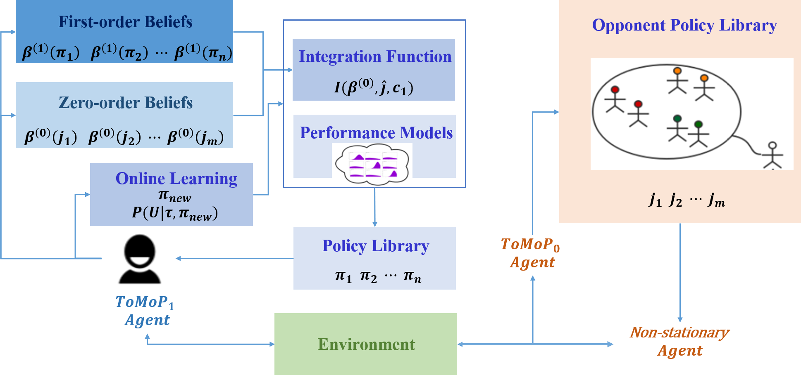

# Bayes-ToMoP

Code for paper "Towards Efficient Detection and Optimal Response against Sophisticated Opponents" published in IJCAI 2019 ("Bayes-ToMoP: A Fast Detection and Best Response Algorithm Towards Sophisticated Opponents” Extended abstract in AAMAS 2019 )

## Introduction

Multiagent algorithms often aim to accurately predict the behaviors of other agents and find a best response accordingly. Previous works usually assume an opponent uses a stationary strategy or randomly switches among several stationary ones. However, an opponent may exhibit more sophisticated behaviors by adopting more advanced reasoning strategies, e.g., using a Bayesian reasoning strategy. This paper proposes a novel approach called Bayes-ToMoP which can efficiently detect the strategy of opponents using either stationary or higher-level reasoning strategies. Bayes-ToMoP also supports the detection of previously unseen policies and learning a best-response policy accordingly. We provide a theoretical guarantee of the optimality on detecting the opponent's strategies. We also propose a deep version of Bayes-ToMoP by extending Bayes-ToMoP with DRL techniques. Experimental results show both Bayes-ToMoP and deep Bayes-ToMoP outperform the state-of-the-art approaches when faced with different types of opponents in two-agent competitive games.

## Training

### Thieves and hunters

run main.py (modify play.py, define.py and players.py)

### Tabular soccer

run main.py

### Deep soccer

run load_soccer.py

### Performance models 

Performance models have been saved in file 'performance model', remember to replace the corresponding models in the root directory

**Directory 'models' save all pre-trained policies using DQN (see RL_brain.py)**

## Some parameters

confidence = 0.2   # initial confidence value c1 for first order belief

learning_rate = 0.3 # adjustment rate for c1

policy_num = 24 # for soccer is 4, for thieves and hunters is 24

memory_length = 26 # for bayes-tomop 1 to check whether use first order belief (soccer sets 26, thieves and hunters sets 150)

threshold = 0.65 # threshold for win rate in the memory_length

is_learning = True # detects the new opponent strategy and begins to learn a new policy against it

